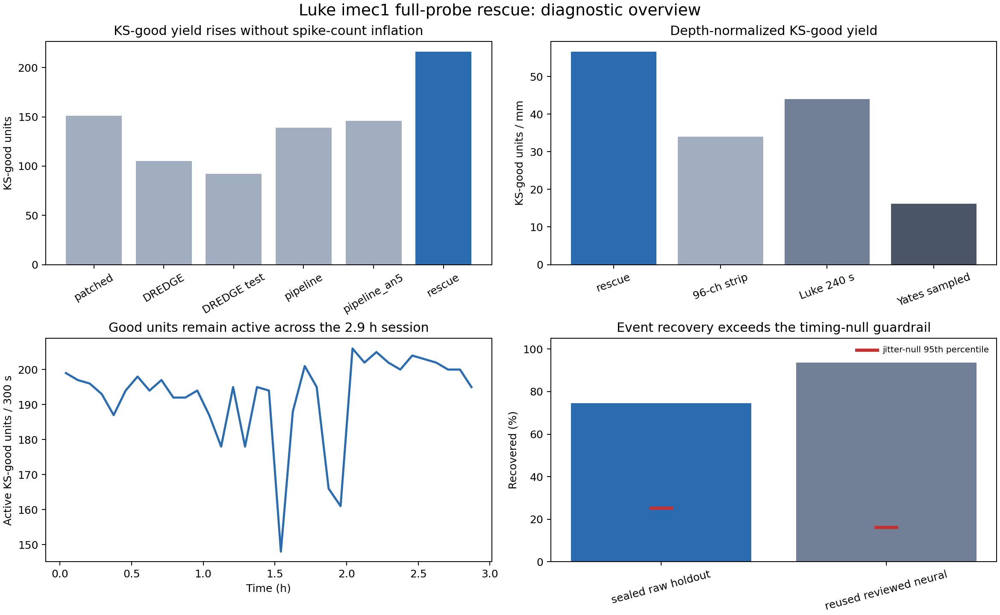

# Luke imec1 full-probe rescue result

> **HISTORICAL YIELD REPORT — interpretation narrowed 2026-09-03.** The run
> completion, counts, and conventional QC measurements stand. They establish an
> engineering reference, not detection or biological superiority: aggregate
> yield and fewer assigned spikes cannot show that more neurons were recovered.
> Cross-sort identity/completeness results were subsequently retracted, and C2
> has not yet shown that rescue handles motion better. Use
> [`validation-summary.md`](validation-summary.md) and
> [decision 0015](decisions/0015-corrected-cross-sort-audits-do-not-establish-equivalence.md)
> for the current evidentiary boundary.

## Technical summary

The new rescue pipeline is a **completed engineering reference with favorable
conventional QC metrics**. It completed the 10,473.6 s imec1 recording with the
frozen settings, produced 583 units and 216 KS-good units, and improved the
best prior full-probe KS-good yield by 65 units (43.0%). Relative to
`pipeline_an5`, it produced 70 more KS-good units (47.9%) while assigning 6.7%
fewer spikes. This argues against indiscriminate aggregate spike inflation but
does not establish per-neuron recall or correctness.

This result does **not** yet establish that Luke matches the full quality of
the Yates sessions. It exceeds the available Yates sampled comparator on raw
and KS-good units per millimetre, but that comparison is confounded by anatomy,
depth, preprocessing, duration and the unusually high contamination of the
available Yates sort. The defensible conclusion is that the run is a useful
operational baseline for targeted validation, not that it is biologically
better or that Yates parity has been proven.

## Key findings

| Endpoint | Rescue result | Comparison / interpretation |
|---|---:|---|
| Final spikes | 43,669,711 | 6.7% fewer than `pipeline_an5`; 98.48% of learned detections retained |
| All units | 583 | 37.2% more than `pipeline_an5` |
| KS-good units | 216 | +65 (+43.0%) versus the best legacy full-probe result; +70 (+47.9%) versus `pipeline_an5` |
| KS-good units / mm | 56.54 | +66.1% versus the prior full-session 96-channel strip; +28.6% versus the 240 s Luke single-pass comparator |
| Median KS-good contamination | 3.55% | Strong internal quality signal |
| Median KS-good 1.5 ms refractory violation fraction | 0.125% | Strong internal quality signal |
| Median KS-good presence in 300 s bins | 100% | 163/216 good units are present in at least 90% of bins |
| Median KS-good lifetime | 10,430.6 s | 99.6% of the 10,473.6 s session |
| Median KS-good depth excursion | 22.23 µm | Plausible longitudinal localization; below the prior strip median of 32.2 µm |
| Holdout-window near coincidence | 29.71% median raw; 7.70% median excess | Below the earlier 35.1% short-window single-pass raw rate and 9.4% full-strip excess |
| Sealed automatic raw-event recovery | 74.54% | Jitter-null mean 22.12%, p < 0.004; independent timing/depth preservation evidence, not manual neural recall |
| Reused reviewed-neural recovery | 93.55% | Descriptive only; 58/62 events, versus 82.26% for the previous `pipeline_an5` comparison |

The spatial guardrails are also encouraging. Only 1.10% of assigned spikes lie
within 40 µm of a probe edge, 0.35% lie within 40 µm of the repaired channel-191
depth, and only four KS-good templates peak in that repaired-channel zone.
Eleven similar nearby good--good template pairs remain, so a small amount of
good-unit duplication is plausible, but removing every member implicated by
that deliberately broad screen would still leave the rescue above the legacy
KS-good ceiling.

## Important limitations and remaining diagnostics

The sealed holdout reveals one localized weakness: automatic recovery is only
47.22% in the middle depth third, compared with 82.64% and 93.75% in the outer
thirds. Recovery is also lower for negative events (64.81%) and 50--75 µV
events (62.50%). Because the holdout was selected automatically from raw extrema
and has no manual neural labels, these values cannot be read directly as spike
recall, but the middle-depth deficit should be inspected before declaring the
pipeline final.

The imec1 polarity signature also persists: 59.0% of all templates and 49.1%
of KS-good templates are positive-dominant. The earlier sampled Yates result was
about 30% positive-dominant. This does not invalidate the sort, but it prevents
a clean biological Luke--Yates density interpretation.

This audit did not reconstruct voltage residuals, measure artifact-sidecar
proximity, perform manual curation, or establish cross-session generalization.
Those are the remaining validation layers. None is a reason to rerun this sort;
they can be performed on the accepted output.

## Historical recommendation

Keep this run as the rescue pipeline's first full-session reference result.
Do not launch another parameter sweep. First review the middle-depth holdout
misses and the 11 similar good--good pairs, then perform residual/artifact
proximity checks on those targeted subsets. If those reviews do not reveal a
systematic failure, the evidence supports adopting this pipeline for a small
multi-session replication cohort. Reserve the claim of matching Yates for that
replication plus an anatomically and technically matched comparison.

## Reproducibility and evidence

- Diagnostic entry point: `testing/luke_full_probe_rescue_diagnostics.py`
- Machine-readable summary: `testing/outputs/luke_full_probe_rescue_diagnostics/summary.json`
- Unit, time, depth, coincidence, recovery and comparison tables:
  `testing/outputs/luke_full_probe_rescue_diagnostics/`
- Accepted run receipt:
  `/mnt/NPX/Luke/20250804/rescue_pipeline_results_Luke0804_V2V1_g0_imec1/kilosort4/rescue_sort_manifest.json`
- The accepted sorter parameters and Kilosort `ops.npy` independently establish
  that motion correction was disabled (`do_correction=false`, native
  `nblocks=0`).
