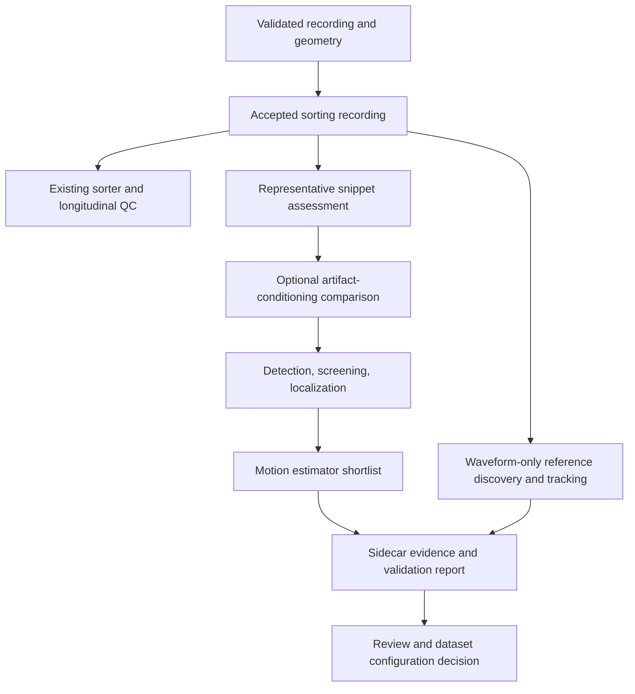

# Integrating waveform-validated motion estimation into the pipeline

**Status:** design proposal grounded in completed Luke experiments; general dataset integration is not yet implemented. Written2026-09-09 UTC. This document complements the executable [screened MEDiCINe workflow](screened_medicine_workflow.md) and [waveform-only lighthouse discovery guide](lighthouse_candidate_discovery.md).

## Purpose and scientific motivation

The goal is to preserve interpretable neuronal identities and spike trains across time. A recording can yield clean-looking clusters and acceptable refractory-period metrics while still losing spikes, fragmenting one neuron into several identities, or retaining a neuron only during quiet periods. Motion estimation is useful insofar as it helps diagnose and eventually reduce those longitudinal failures. A smooth displacement trace, a large displacement estimate, or a higher unit count is not the final endpoint.

This follows the repository's [hindsight-first development prescription](spikesorting_hindsight_development_prescription.md): establish trustworthy diagnostics, compare mature pipelines on meaningful recording durations, and introduce custom methods when a concrete residual failure warrants them. Short snippets are controlled experiments; success on them does not establish full-session sorting efficacy.

The proposed contribution is a testable process connecting three kinds of evidence:

1. **Population observations:** detected peaks, their amplitudes, locations, and spatial/temporal coverage.
2. **An estimated motion field:** produced by an established estimator under explicit settings.
3. **Individual waveform observations:** distinctive candidate identities matched independently of the motion field, including uncertain and missing observations.

Agreement across these views is more informative than inspecting an estimator output alone. They are not statistically independent measurements: the peaks and waveforms originate from the same voltage, and templates can share a biological identity. “Independent” here means that the estimator's predictions do not determine which waveform events are accepted or where their identities are searched.

## What we mean by naive drift estimation

Here, “naive” describes a workflow: detect/localize peaks with inherited defaults, fit a motion estimator, and accept the returned trace without checking its input population, temporal resolution, displacement range, or identifiable cells. It does **not** mean that DREDGE or other mature algorithms are intrinsically naive.

Several failure modes were exposed by the Luke investigation:

| Assumption in an unchecked workflow | What can go wrong | Proposed check |
|---|---|---|
| More detected peaks always provide more useful information | Shared artifacts or stationary contamination can dominate the population | Inspect peak rasters and waveform features; compare preprocessing and screening controls |
| A flat estimate means little motion | Input contamination or restrictive settings can suppress real movement | Compare individual waveform displacements and input coverage |
| A template at its original channels is a stable reference | A moving cell can leave the measurement support, causing dropout or biased apparent stationarity | Move waveform support with each whole-probe depth hypothesis |
| A plausible trace has enough temporal resolution | Histogram or motion smoothing can attenuate brief excursions | Compare predictions at actual waveform event times and inspect large movements separately |
| Search bounds are merely implementation details | A bounded pairwise search may be unable to match a large shift directly | Persist resolved bounds and inspect their meaning and saturation |
| A single agreement score identifies the best method | Stationary observations and pooled summaries can hide individual failures | Separate evidence classes, movement sizes, cells, and support counts |

These are local findings and general failure hypotheses, not proof that every dataset has these problems. The [shared-response compensation experiment](luke_shared_response_compensation_20260907.md) provides a controlled example of input conditioning changing DREDGE sensitivity; the [limits/sigma audit](luke_dredge_limits_sigma_audit_20260908.md) records the historical displacement and smoothing restrictions.

## What is working now

### Whole-probe waveform references

The current lighthouse workflow preserves the relative multichannel waveform shape while excluding absolute depth from identity ranking and matching. All complete seed templates compete across the available probe support. A match can occur far from its original position; the measurement window moves with that hypothesis. Absolute waveform depth is calculated after matching.

For Luke, the frozen bank contains247 competing templates and the training-only selection produced17 provisional candidates. Matching retains strict accepted events, lower-score evidence, identity ambiguity, and unmatched detections. It uses exact40 µm translations of16-channel patches and±3 sample alignment. These choices are practical approximations, not calibrated depth precision. Lookalikes, incomplete probe-edge support, overlapping spikes, and waveform evolution remain possible.

This addresses the circularity of using depth proximity or the motion field under test to constrain the reference identities. The reference can now reveal shifts that older fixed-template or nearby-only searches could miss. See [candidate discovery](lighthouse_candidate_discovery.md) and the [depth-aware policy](luke_depth_aware_lighthouse_policy_20260908.md).

### Screened population input and a small estimator shortlist

The completed930–1030 s comparison evaluated40 combinations: DREDGE and MEDiCINe, five detection thresholds, and four screening settings. The same saved population arrays were supplied to both estimators within each combination, while lighthouse identities and evidence classes stayed frozen.

On strict waveform observations after940 s:

| Configuration | All observations: median discrepancy | Excursions≥120 µm: median discrepancy |
|---|---:|---:|
| MEDiCINe5σ, relaxed screen | 11.4 µm | 24.4 µm |
| MEDiCINe6σ, full screen | 10.0 µm | 27.3 µm |
| DREDGE8σ, full screen | 12.3 µm | 58.3 µm |

Each entry is the median across candidate-specific median absolute differences. At least five observations are required per candidate/class/scope;14 candidates contribute overall and six contribute to the large-excursion column. Offsets use the existing seed reference; no later alignment, sign, gain, or lag was fitted to improve agreement. These are descriptive discrepancies, not calibrated physical errors or independent-cell confidence intervals.

The screened MEDiCINe shortlist is promising because it agrees more closely with several individual moving candidates, especially during large excursions, while screening reduces threshold sensitivity. The conclusion is not universal: DREDGE performs particularly well for unit555, and every shortlisted variant misses unit161's large excursion by about450 µm. Nearby MEDiCINe configurations are not decisively separated by these data.

Sources: [per-candidate comparisons](../testing/outputs/luke_ap_methods_completed40_v1/per_candidate_differences.csv), [aggregate comparisons](../testing/outputs/luke_ap_methods_completed40_v1/descriptive_agreement.csv), and [5σ/8σ trace plots](../testing/outputs/luke_ap_methods_completed40_v1/02_head_to_head_5sigma_8sigma.pdf). These results helped select the shortlist; they are calibration evidence, not an unseen validation set.

### A practical five-minute implementation

The930–1230 s benchmark completed all three fits and reports in818 seconds, or13.6 minutes. It reused the first100 s of cached population evidence and extracted the additional200 s, so this is **not** a cold-start five-minute runtime.

| Fit | Retained peaks | Fitting time |
|---|---:|---:|
| 5σ/relaxed,10000 steps | 296684 | 67 s |
| 5σ/relaxed,30000 steps | 296684 | 200 s |
| 6σ/full,10000 steps | 112156 | 75 s |

The new wrapper reproduced the cached100 s primary field exactly. Two targeted tests verified that bounded feature batches preserve features/masks and that dropping unrelated events does not change retained-event localizations. New extraction localized193271 of358899 union detections, avoiding about46% of localization work. Peak extraction-process RSS was approximately5.8 GiB. Avoided work is not a measured end-to-end speedup against a matched unoptimized run.

The optimization retains one continuous field over the full snippet. It does not stitch independently centered short fits or change model precision, waveform thresholds, temporal kernels, or reference offsets. The longer training run tests budget sensitivity; more steps are not presumed to mean greater accuracy. See [benchmark measurements](../testing/outputs/luke_screened_medicine_300s_v1/benchmark.csv), [reproduction check](../testing/outputs/luke_screened_medicine_300s_v1/reproduction.json), and [five-minute plots](../testing/outputs/luke_screened_medicine_300s_v1/01_depth_time_and_fields.pdf).

Waveform tracking for1030–1230 s was launched separately with the same frozen identities and matching code. Its results should be assessed before claiming lighthouse validation of the full five minutes. The [extension run note](luke_lighthouse_extension_300s_20260909.md) identifies its artifacts and completion contract; launch alone is not a validation result.

## Why this is promising relative to the unchecked workflow

The benefit is a better-controlled chain from voltage to interpretation. Screening can reduce irrelevant population structure; appropriate bounds and temporal settings let an estimator represent the movements of interest; waveform-only references can reveal underestimation, dropout, and identity ambiguity. Direct plots allow disagreements to be investigated rather than hidden in a smooth population summary.

This also makes failures actionable. A mismatch can motivate inspection of peak coverage, artifact conditioning, identity rivals, offset conventions, or model capacity. It need not immediately trigger a new estimator or a larger hyperparameter sweep. The cheaper alternative is often to inspect cached observations for a few cells and events first.

We have not yet demonstrated cross-dataset superiority, full-session reliability, or improved downstream sorting from applying these fields. The method should therefore enter the pipeline as an evaluable diagnostic stage with explicit uncertainty.

## Proposed pipeline architecture

The production contract currently says that motion is **estimated and recorded, never applied to voltage**. The existing [motion sidecar](../pipeline/motion_sidecar.py) returns the accepted sorting recording without constructing a motion warp. This proposal preserves [decision0002](decisions/0002-motion-is-estimated-never-applied.md); it does not silently replace the rigid DREDGE production schema with nonrigid MEDiCINe output.

There is deliberately no motion-field-to-voltage edge. Any future correction branch requires a separately validated operator, versioned crossover policy, agreed advancement metrics, and authorization under the existing decision record. A good estimation report does not satisfy those requirements by itself.

### Reusable stages and dataset-specific inputs

| Stage | Shared implementation | Dataset-specific decisions |
|---|---|---|
| Recording assessment | Geometry/time checks; representative raster and waveform views | Channel map, shanks, sampling rate, units, bad channels, representative intervals |
| Conditioning | Explicit preprocessing branches and preservation checks | Reference strategy; whether an artifact model is necessary; calibration interval |
| Population extraction | Chunking, feature batches, masks, localization and caches | Noise estimates, detection thresholds, screening applicability and localization geometry |
| Motion fitting | Versioned estimator adapters and common output contract | Spatial model, temporal resolution, motion range, training budget |
| Lighthouse evidence | Depth-independent identity competition and uncertainty retention | Available templates, distinctive cells, channel support, reference interval |
| Evaluation | Event-time comparisons, support tables and failure reports | Calibration/validation split, scientific priorities and acceptance criteria |

The Luke compensation coefficients and noise vectors must never become defaults for another recording. The current CLI is explicitly Luke-specific and starts at930 s; it is not a general dataset adapter. Its20 s extraction chunks, feature memory bounds, and separate fit interface are reusable patterns. For other probes, construct compatible waveform support from actual geometry instead of assuming384 channels or the Luke40 µm lattice.

### Proposed artifact contract

Introduce a new versioned diagnostic contract rather than overloading the existing rigid-only schema. It should preserve:

- Dataset identity, accepted recording receipt, geometry, physical units, time origin and segment mapping.
- Calibration and validation intervals; preprocessing branches; resolved detection/screening settings; model/noise provenance.
- Peak identifiers, amplitudes, locations, masks, feature evidence and coverage, with empty outcomes retained.
- Estimator name/version/source hash, random seed, device, all resolved parameters, native field grids and supported domain.
- Frozen reference identities, templates, seed support, rival scores, evidence classes, unmatched events and gaps.
- The exact offset/reference convention and evaluation support; no silent time/depth extrapolation.
- Per-cell and aggregate descriptive results, figures, explicit uncertainty reasons, runtime/memory, launch command, job identifier and final exit receipt.

Keep operational status separate from scientific status: a completed fit can have insufficient reference evidence or require review. Proposed scientific labels are “supported on evaluated intervals,” “insufficient evidence,” and “requires review”; their decision criteria must be defined prospectively. Do not interpret a completed process as a scientific pass.

## How the tests fit together

| Test level | Purpose | Proposed execution |
|---|---|---|
| Small deterministic tests | Coordinates, masks, geometry translation, empty/boundary behavior and localization independence | Ordinary code-change tests; no raw recording required |
| Cached numerical regression | Detect unintended changes to a frozen field and input mapping | Relevant implementation/runtime changes; GPU fixture where available |
| Snippet integration | Exercise extraction, caches, fitting, provenance, reports and terminal status | Representative dataset fixture; independent managed job |
| Scientific comparison | Compare actual waveform events, large movements and support, preserving failures | Calibration and unseen validation snippets |
| Scaling and lifecycle | Runtime/memory trends, cache integrity, interrupted-stage refusal, survival after disconnection | Scheduled benchmark or changes to execution/storage |
| Longitudinal pipeline evaluation | Spike completeness, identity stability, fragmentation, contamination and duplicates | Existing development ladder on long recordings and additional datasets |

Existing entry points include [optimization tests](../testing/test_luke_screened_medicine.py), [sidecar tests](../testing/test_motion_sidecar.py), and the [development ladder](../testing/run_development_ladder.py) with its [example comparison configuration](../configs/example.development_comparison.v1.json). Wiring the new scientific artifacts into that ladder is proposed work, not an implemented feature of this document.

Keep hard software checks separate from scientific review. Corrupt caches, invalid coordinates or failed processes can fail immediately. Sparse lighthouse support or a biological discrepancy should initially produce a clear review outcome. Define any future numerical accuracy gate before examining validation results. Retain per-cell results so a median cannot hide a severe miss. Lower-score and ambiguous references should inform sensitivity analysis rather than silently carry the same authority as strict matches.

## Generalization and scaling strategy

1. **Assess each dataset cheaply.** Inspect a small set of quiet and challenging intervals with useful depth coverage. Confirm units, geometry and time origin before fitting.
2. **Calibrate on designated snippets.** Begin with a small established-estimator shortlist. Compare ordinary preprocessing with optional dataset-specific compensation only when artifacts warrant it; check waveform preservation.
3. **Freeze choices before validation.** Keep interval selection, model settings and reference rules distinct from later evaluation. Do not tune identities toward the field being tested. Some datasets will have too few distinctive references; report this directly.
4. **Evaluate unseen times and recordings.** Check different motion regimes, depths, signal densities and artifact patterns. Preserve quiet intervals as well as obvious movement. No-motion estimates need informative support too.
5. **Scale only after direct evidence is adequate.** Chunk voltage extraction and reuse completed evidence. Track peak-array growth and fitting budget with duration. If overlapping fits become necessary, test overlap consistency and reconcile gauge offsets explicitly; naive concatenation can create artificial jumps. Window stitching is not implemented in the current benchmark.
6. **Advance against the scientific endpoint.** Use the motion sidecar to diagnose longitudinal sorting failures and guide controlled pipeline comparisons. Any correction experiment remains a separate branch with waveform-preservation and downstream efficacy tests.

Maintain a benchmark collection spanning probes, species/preparations where available, firing densities, noise/artifacts, mild drift, abrupt excursions and recording duration. Dataset identifiers and splits belong in the benchmark manifest. Synthetic or imposed-motion tests can expose known failure modes, but should not replace real-data waveform checks and longitudinal sorting comparisons.

## Near-term integration milestones

- Review the frozen1030–1230 s extension, especially shared movements across multiple candidates, dropouts, and the persistent unit161 discrepancy.
- Compare the two training budgets at the same event support and inspect full-span peak/field views before choosing a longer-snippet default.
- Extract a dataset configuration layer from the Luke-specific runner, with explicit geometry, time origins, noise and optional conditioning inputs.
- Add a versioned nonrigid diagnostic artifact adapter alongside the current sidecar; preserve the existing sorter-recording identity contract.
- Register cached, integration and scientific fixtures in the development ladder, with calibration/validation splits recorded before evaluation.
- Validate on another interval and another dataset before adopting a broadly recommended configuration.

## External methods and context

DREDGE is an established method for estimating relative probe/tissue motion from electrophysiological data, with AP/LFP capabilities and validation across recording conditions. It remains a meaningful baseline and comparison method; Luke's historical±80 µm helper and inherited smoothing settings are local implementation choices, not limitations of the method as a whole. See [Windolf et al., DREDge, Nature Methods2025](https://pubmed.ncbi.nlm.nih.gov/40050699/) and the [authors' implementation](https://github.com/evarol/dredge).

MEDiCINe jointly optimizes a motion representation and an activity distribution using detected spike observations. This provides a different modeling approach to compare against correlation-based registration; it does not remove dependence on informative inputs or sufficient optimization. See [MEDiCINe: Motion Correction for Neural Electrophysiology Recordings](https://pmc.ncbi.nlm.nih.gov/articles/PMC11896784/) and the [authors' implementation and explanation](https://github.com/jazlab/medicine). The upstream repository includes correction examples, but those examples do not override this repository's diagnostic-only production policy.

Local implementation details, historical branches and exact bounds/kernel meanings are documented in [AP motion methods](luke_ap_motion_methods_20260908.md). The published methods motivate the estimator choices; the local artifacts support the Luke-specific numbers and conclusions in this document. This proposal does not claim that the local lighthouse workflow or screening shortlist has been externally validated.
